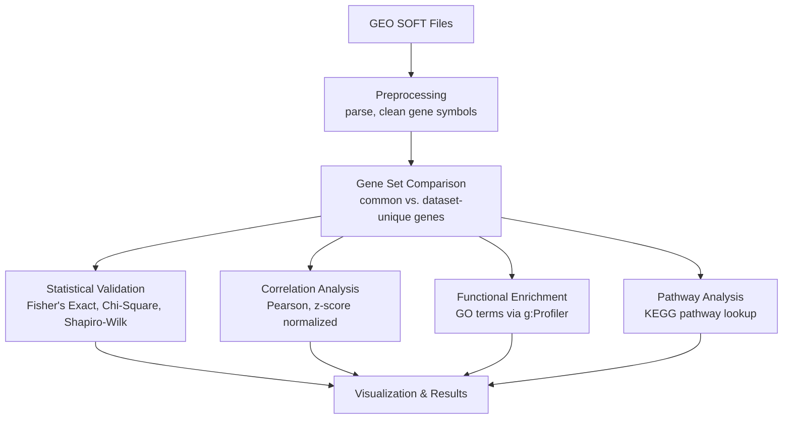

# Comparative Transcriptomic Analysis of Neurodegeneration and Viral Infection: A Multi-Method Validation Framework


A gene expression analysis pipeline comparing a neurodegenerative disease dataset against a viral infection dataset, using statistical testing, correlation analysis, and pathway enrichment to identify shared and divergent transcriptomic signatures.

International collaboration with Dr. Leyla Baghirzada (University of Calgary).

## Table of Contents

- [Overview](#overview)
- [Architecture](#architecture)
- [Project Structure](#project-structure)
- [Data](#data)
- [Methodology](#methodology)
- [Setup](#setup)
- [Usage](#usage)
- [Limitations](#limitations)
- [Tech Stack](#tech-stack)
- [License](#license)

## Overview

This pipeline compares gene expression profiles from Parkinson's disease (GDS5646) and Influenza (GDS6063) datasets, sourced from NCBI's Gene Expression Omnibus, to characterize the overlap between neurodegenerative and viral-response gene expression signatures. The framework applies multiple independent validation methods, statistical significance testing, correlation analysis, and functional pathway enrichment, so that any observed overlap is supported by more than one line of evidence.

## Architecture



## Project Structure

```
comparative-transcriptomic-analysis/
├── transcriptomic_analysis.py   # End-to-end pipeline
├── requirements.txt
├── .gitignore                    # Excludes raw data and generated results
├── data/                         # Raw GEO SOFT files and converted CSVs (gitignored)
├── results/                      # Generated CSV outputs (gitignored)
└── README.md
```

## Data

Two public datasets from NCBI's Gene Expression Omnibus:

| Dataset | Condition | Role |
|---|---|---|
| GDS5646 | Parkinson's disease | Neurodegeneration proxy |
| GDS6063 | Influenza | Viral infection proxy |

Both are distributed as GEO SOFT files, parsed into gene-by-sample expression tables restricted to `GSM`-prefixed sample columns.

## Methodology

### 1. Preprocessing
Parses each SOFT file's data table, standardizes gene symbols (uppercase, whitespace-stripped), and drops incomplete records.

### 2. Gene Set Comparison
Identifies genes common to both conditions versus genes unique to each, as the starting point for downstream analysis.

### 3. Statistical Validation
- **Fisher's Exact Test**: tests whether the observed gene overlap is significant against an approximate human protein-coding gene background
- **Chi-Square Test**: independence test on the same contingency structure, as a cross-check against Fisher's exact result
- **Shapiro-Wilk Test**: checks normality of expression values, informing whether parametric methods (like Pearson correlation) are appropriate

### 4. Correlation Analysis
Expression values are z-score normalized per sample (via `StandardScaler`) before computing Pearson correlation between conditions across shared genes, isolating genes with the largest absolute expression divergence between conditions.

### 5. Functional Enrichment (GO)
Runs Gene Ontology enrichment on the common gene set via g:Profiler, to characterize the biological processes the shared genes are involved in.

### 6. Pathway Analysis (KEGG)
Cross-references common genes against KEGG pathway data to identify shared biological pathways. Capped per run (default 100 genes) since each lookup requires two sequential API calls; a standalone single-gene lookup utility is also included for targeted queries.

## Setup

```bash
pip install -r requirements.txt
```

Place the raw GEO SOFT files in `data/`:
```
data/GDS5646_full.soft
data/GDS6063_full.soft
```

## Usage

```bash
python transcriptomic_analysis.py
```

Runs the full pipeline end to end and writes gene set comparisons, GO enrichment, and KEGG pathway results to `results/`.

## Limitations

- Each dataset serves as a proxy for a broader condition category (a single Parkinson's dataset for "neurodegeneration," a single Influenza dataset for "viral infection"); findings reflect these specific datasets rather than the categories at large
- KEGG pathway analysis is capped at a configurable gene limit per run due to API call volume; full-scale runs across the entire common gene set would require batching or a longer runtime
- No automated test suite currently covers the preprocessing or statistical functions

## Tech Stack

| Category | Tools |
|---|---|
| Data processing | pandas, numpy |
| Statistics | scipy (Fisher's exact, chi-square, Shapiro-Wilk) |
| Machine learning utilities | scikit-learn (StandardScaler) |
| Pathway & enrichment analysis | g:Profiler (gprofiler-official), bioservices (KEGG) |
| Visualization | matplotlib, seaborn, matplotlib-venn |

## License

MIT, see [LICENSE](LICENSE).

## Author

Nurana Verdiyeva, in collaboration with Dr. Leyla Baghirzada (University of Calgary)
